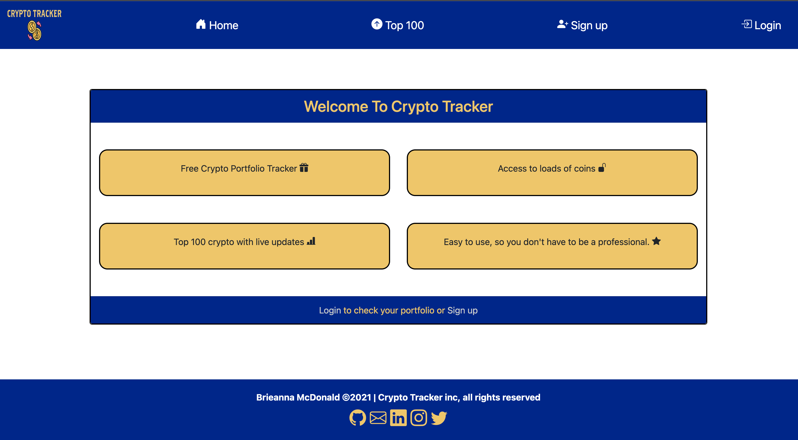
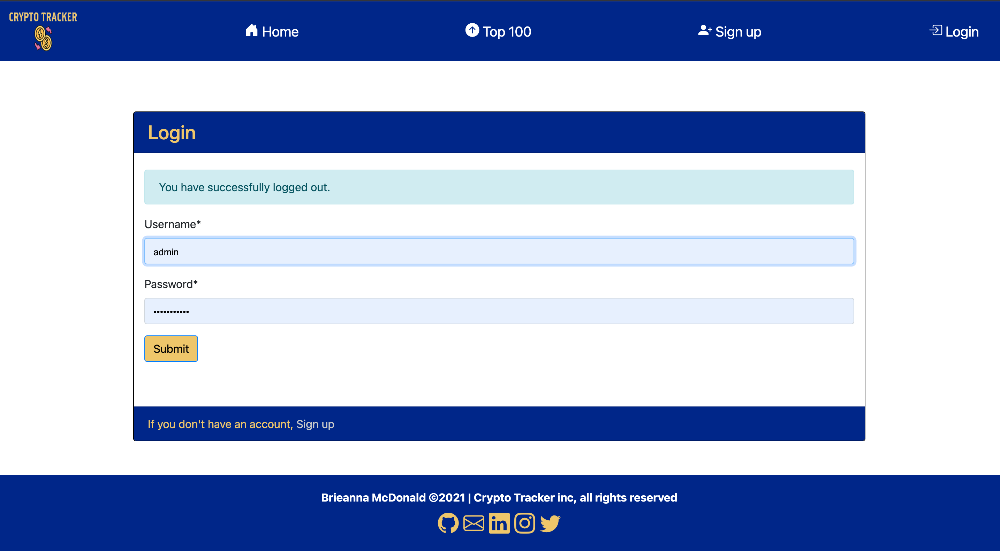

# Crypto Tracker

:globe_with_meridians: [Live Website](https://https://salty-reef-05763.herokuapp.com),

 [Github repository](https://github.com/bmcdonald2000/cryptoTracker)

## Project Goal

Crypto Tracker is a cryptocurrency portfolio application that makes trading cryptocurriencies easier for novice crypto traders by presenting data in a format that is easy for the user to digest, whilst ensuring they have sufficient information to make profitable trades.

<strong>Table of contents:</strong>

 

[User Experience (UX)](##User-Experience-(UX))

[Features](##Features)

[Technologies used](##Technologies-used)

[Testing](##Testing)

[Deployment](##Deployment)

[Known bugs](##Known-bugs)

[Credits](##Credits)

## User Experience (UX) 

### User Stories

I have broken down the user stories into site user and site admin. I have used the MoSCoW prioritisation technique to keep the project on track. Below is a key for the lables used in this technique. :point_down:

**Key:**

|Label| Definition|
|-----------------|-----------|
| |Requirement is necessary for the project to be conisdered as successfully completeted.|
| |Requirement is important but not neccessary for the project to be conisdered as successfully completeted.
| |Requirement is a bonus to the project and if not included the impacts are less significant that a 'must have' or 'should have'.|
|| Requirement are not considered as a priority for the project, given the timeframe but may be revistited when implementing future features.|

**Site User**

• As a new visitor I want to be able to make a profile. 

• As a returning visitor I want to be able to access my profile. 

• As a visitor I want to be able to understand the purpose of the site. 

• As a new visitor, I want to be able to signup 

• As a returning user, I want to be able to login. 

• As a logged in user, I want to be able to log out. 

• As a returning user I want to be able to login using my gmail account. 

• As a logged in user, I want to be able to track my investments. 

• As a logged in user, I want to be able to get detailed insights into my investment. 

• As a logged in user, I want to be able to see where I am making profit and/or loss without having to read the graphs. 

° As a logged in user, I want to be able to edit my coin/token quantity.  

° As a logged in user, I want to be able to delete a coin from my portfolio. 

• As a returning user I want to be able to access my portfolio easily from any page. 

• As a user I want to be able to see data without having to login. 

**Site Admin**

• As site admin, I want to have acess to an admin panel. 

• As site admin, I want to be able to view, edit and or delete user and portfolio information.

### Design :art:

The main goal was to make an intuitive UX, so that the user is not confused when visiting the Website. To achieve this, I created a simple, succinct, web application. The navabar is present on every page with clear icons for easy navigation.

The user experience should be tailored. To ensure this navbar items vary based on whether the user is authenticated, so that users who are not logged in aren't shown features that are not available to them.

If a user tries to access a page they are not auhtorised to, they are informed why they can't see the page and a link is provided so that they can rectify the issue in one click. 

All user actions shoud return a response. To ensure this is possible there are specific success and error messages displayed as result of a user action. Page redirects are also used to make it obvious that an action has been successfully completed.

**• Colour scheme**

   • Intially the colour scheme was monochrome, black (#ffffff) and white (#000000). Following user feedback I have gone for a simple blue (#012389) and yellow (#ECC76A) design, as this is a  but trendy colour scheme. All  text  is displayed in black (#ffffff), yellow ((#ECC76A)) or white (#000000) subject to what allows for greater contrast, to enusre accessibility for all users. All Icons are yellow (#ECC76A) or black (#ffffff) to keep with the colour scheme.
   
    ° To ensure theres suffcient contrast bewteen page elements I used [WebAim](https://webaim.org/resources/contrastchecker/). 

   ° I also changed the link colours to ensure the page is as accessible as possible. The links default colours did not past the contrast test. So the links are now a light blue (#A3CEFF) when unvisted, white (#000000) on hover and grey (#C9C9C9) when visited. 

   

**• Typography**

   ° In keeping with the minimalistic style of the website, I have chosen to use an original fixed-width type family font 'Space Mono' as it was developed for editorial use in headline and display typography. Tying in with the purpose of the web application. 
   
   ° I want the users to be carefree whislt using the site as the purpose of the site is to make trading easier and more accessible. The style of 'Space Mono' makes it easy to read and fosters the care free vibe, I want the users to experience. 

**• Imagery**

   ° The icons used throughout the site are [Boostrap](https://unpkg.com/boxicons@2.0.9/css/boxicons.min.css') icons

   ° The logo was created using [Tailor Brands](https://www.tailorbrands.com/logo-maker) 

**• Wireframes**

   ° Wireframes were created using figma. To meet my UX objective of creating a simple and intuitive User Interface (UI), I took a minimalisitic approach with the wireframes, to provide flexibility so that the project can evolve in accordance with user feedback. Without straying from the mnimilistic theme. Here is the link to [my wireframes](https://www.figma.com/file/Qez5PDoTgK13VKMNM34O4V/Crypto-Tracker?node-id=0%3A1) for desktop and mobile. Following user feedback additional features were added so not all features are included in the wireframe. However, all [features](##Features) will be discussed later in the README. Below are screenshots of the desktop and mobile Wireframes. :point_down: 

  **Home**
  Following user feedback the intial homepage wireframe was used to design the top100 page and the current home page explains what the site is offering to make its purpose even clearer to users. 

   

  **Portfolio**
  The wire frames for the portfolio was closely followed and the only changes that have been made is that the users recieves a personalised welcome message, if authorised to acces the portfolio page.

   

   
## Features 

As previously explained (:point_up: ) new features were added during the project in response to user feedback. I will be explaining the current features to help demonstrate the progression of the project. Some future features will also be discussed.

**Site User**

First I will be looking at the features for site users

### **Current Features:** :white_check_mark:

#### **Nav Bar**

• The Navbar is available on every page, this allows seamless navigation across the web application, ensuring the main features are acessible in one click. The standard Navbar is show below. :point_down:

• The navbar is also personalised so that the user experience is tailored. 

  ° When logged in the user will see a Navbar that looks similar to the screenshot below. :point_down:

  

  ° The standard Nav bar is shown when a user is not logged in, this is so that the user is only shown areas they have access to.
    
#### **Landing page**

• The landing page is simple keeping with the minimalistic theme of the site. The user can see the main perks of the site, making its purpose clear.

° login and signup links easily accessible from the page and navbar

#### **Top 100**

• The Top 100 page, shows the top 100 crypto with the essential data. 

° I used existing crypto portfolio sites and beginner crypto trader feedback to dertermine what data was essential.

#### **Registration**

• The Signup form can be seen below, this form is easily accessible from the Navbar. :point_down:

° Links for the login page are available for the login page also.

#### **Add to Portfolio**

• A modal is used to add tokens to the users porfolio, this modal is opened using the add to tracker button :point_down:

° The modal has dropdown fields to allow the user to select an existing coin and symbol.

° The modal also has a field where the user can enter the number of tokens they own.

° When the tokens have been successfuly addded the user sees a message similar to the one below :point_up:. Highlighting the amount and token inputted by the user.

° If the user is not logged in and tries to access the portfolio page, they will be prompted to login or sign up. With links to the relvant form being displayed. (Shown below) :point_down:

#### **Login/Logout**

• Django authentication is used for user login/logout. The user is able to tell when they are logged in by the changes in the nav bar (these have been shown previously :point_up: ). 

° The login form is shown below.

° Sign up links are easily accessible from the login page.

° When logging in the user is prompted if the login is successful. 

° When logging in the user is prompted if the login is unsuccessful. 

° When the user logs out they will recieve an alert.

#### **Footer**

• The footer contains buttons with links to Github, LinkedIn and Email where the can contact me. Twitter and Instagram links are also included although the bloggerverse does not have a page on these platforms. All of the links open in a new tab for the users convenience. :point_down:

### Future features :rocket:

• In the future users will be able to login using exsting social media accounts such as google to make logging in easier.

• In the future users will be able to edit and delete tokens in their portfolio.

• In the future a blog section will be added to allow users to share trading tips and strategies.

• In the future a live news feed snippet of trends that could impact trades will be added.

• In the future Graphs showing market data will be added.

• In the future a Learning section to allow users to learn how to read graphs, glossary of key trading jargon will be added.

**Site Admin**

### **Current Features:**

The Admin panel currently allows control over the following:

##### Users

• Admin can Add users
• Admin can Delete users

##### Portfolio trackers

• Admin can Add portfolio
• Admin can Delete porfolio
• Admin can Edit portfolio
• Admin can view portfolio

Here is a screenshot of the admin panel :point_down:

## Technologies used:

#### Languages and librarys used

#### Database used

In Development I used the Django default database SQLite, this is not compatible with Heroku so I switched to Heroku Postgres Prior to Deployment.

#### Cloud Deployment

My web application is deployed on heroku, the [steps taken](##Deployment) are disccused later in the README.

#### Programs used

[Canva](https://www.canva.com/) - I used Canva to remove the background colour of my logo.

[AmIResponisve](http://ami.responsivedesign.is/#) - I used amiresposive to generate the resposive image at the start of my Readme.

[Tailor Brands](https://studio.tailorbrands.com/) - I used Tailor brands to create my logo.

[Git](https://git-scm.com/) - I used Git to track the changes to my code. Git was also used for version control.

[Github](https://github.com/) - Github was used to host my project files. I then used Gitpages to deploy the website.

[Vs Code](https://code.visualstudio.com/)- VS Code powers gitpod and was used to build the website.

[Google Fonts](https://fonts.google.com/) - The fonts used are google fonts.

[Figma](https://www.figma.com/) - I used figma to design my mockups.

[Gitpod](https://www.gitpod.io/blog/next-chapter-for-gitpod) - Gitpod is powered by VS Code, storing my code in the cloud. I can then commit that code to my Github repository as Gitpod and Github are connected.

[Lighthouse testing](https://developers.google.com/web/tools/lighthouse) - I used lighthouse testing to test the performance of my webpage.

 
	

## Testing :test_tube:

### Code Validation
• W3C HTML Validator 

° landing page - [passed](https://validator.w3.org/nu/?doc=https%3A%2F%2Fsalty-reef-05763.herokuapp.com%2F)
   
  click the hyperlink above to view my final results. :point_up_2:	

Initially I did recieve some intial errors and a warning. These are shown in the screenshot below. :point_down:	

° Top 100 - [passed](https://validator.w3.org/nu/?doc=https%3A%2F%2Fsalty-reef-05763.herokuapp.com%2FTop%2520100)

° Login - [passed](https://validator.w3.org/nu/?doc=https%3A%2F%2Fsalty-reef-05763.herokuapp.com%2FLogin)

° Registration - [passed](https://validator.w3.org/nu/?doc=https%3A%2F%2Fsalty-reef-05763.herokuapp.com%2FRegistration)

  The only error that shows is due to the form validation rules and not my code. This is evidenced in the screen shots below :point_down:

  

  

° Portfolio - [passed](https://validator.w3.org/nu/?doc=https%3A%2F%2Fsalty-reef-05763.herokuapp.com%2FPortfolio)

• W3C CSS Jigsaw Validator - [passed](https://jigsaw.w3.org/css-validator/validator?uri=https%3A%2F%2Fsalty-reef-05763.herokuapp.com%2F&profile=css3svg&usermedium=all&warning=1&vextwarning=&lang=en#warnings)

  click the hyperlink above to view my results. :point_up_2: 

• JsHint - I recieved no errors using the jshint validator but did recieve some ES6 and ES8 warnings so I used an ES6 and ES8 validator to check there were no errors in my code.

° ES6 Validator - [passed](https://www.piliapp.com/syntax-check/es6/)

  click the hyperlink above to see the site I used. :point_up_2: My results are shown below :point_down:

° ES8 validator - [passed](https://esprima.org/demo/validate.html)

  click the hyperlink above to see the site I used. :point_up_2: My results are shown below :point_down:

• Python - Passed

  Initially I had quite a few errors relating to line spacing and line length. These have since been corrected and there are no errors in my workspace. All python code is PEP8 compliant. I have tested the code in all of the files listed below :point_down: using a [PEP8](http://pep8online.com/) validator and I used the [pydocstyle](https://code.visualstudio.com/docs/python/linting#_pydocstyle) linter extension in vscode.

  The settings.py file returned two errors due to Django rules allowing longer line lengths (88 characters) than PEP8 (79 charcaters. 

  This is shown in the screenshot below :point_down:

  

  The Django-Heroku package I have used in my project is also causes an error as it must be importaed at the end of the file, this goes against PEP8 rules but have passed validation using a DJango lynter. 

  This is shown in the screenshots below :point_down:
  

  

  ° crypto_portfolio:
  
    • settings.py
    • urls.py
    • wsgi.py

  ° crypto:
    
    • apps.py
    • urls.py
    • views.py
    • models.py
    • forms.py

### Performance testing
   
   To test my web app performance, I used lighthouse testing.

  **•Lighthouse testing**
  The overall performance of my webpage is good but there is room for improvement in best practices. As seen in the screenshot below. 

   

    The low score in this area is largely because jquery was also used in this project, this is a library that has known security risk. I will do my best to refrain from using/minimise the use of jquery for future projects to maintain best practices. 

  
##### Browser Compatibility

The above HTML and CSS Validators test for valid code that is compatible with all browsers.

The following functions were tested on the following browsers using a pass / fail system:

|   Function	    |  Browser 	| Result  	|
|-----------------|-----------|-----------|
| Navbar links |    |   PASS	
|  Login/Signup forms  |     |	 PASS  	|
| Django messages|     	 	|   PASS	|
| Add to tracker button |      	|   PASS	|
| Top 100 table|     	 	|   PASS	|
Footer Links 	  |     	|  PASS 	|

• OS compatibility was tested on iOS 14.8, Android 11, ipadOS 15, Windows 10 and MacOS Monterey.

• The devices used include but are not exclusive to Macbook Pro, iphone XR, HTC 11, iphone 11Pro and iPad air. To ensure the website was thoroughly tested I used [Chrome Dev Tools ](https://developer.chrome.com/docs/devtools/)to test on a range of viewports from 320px up to 2560px.

 ### User testing :bust_in_silhouette:

• I shared the web app with family and friends of varying ages and computing skills to test the ease of navigation on a variety of devices. There were no issues with navigation.

• I also used testers to check that the button and modal were working and there were no broken links. No broken links were found but there were a few no reverse errors, these issues have been corrected. After corrections were made I asked for them to be tested again and everything was working as expected.

#### User story testing  

As demonstrated by the table below :point_down:, all intended user stories have been implemented. Screenshots of the relevant features can be seen in the [features](## Features) sectio above :point_up:

## Deployment

As previously mentioned this project was developed using a [GitPod](https://www.gitpod.io/blog/next-chapter-for-gitpod)workspace. The code was committed to [Git](https://git-scm.com/) and pushed to [GitHub](https://github.com/) using the terminal. The code was then remotely deployed to Heroku.

### Deploying on Heroku
To deploy this blog app to [Heroku](https://www.heroku.com/) from its [GitHub repository](https://github.com/bmcdonald2000/cryptoTracker),the following steps were taken:

1. Create the Heroku App:

  • Select `Create new app` in Heroku.
  • Choose a name for your app and select the location.

2. Attach the Postgres database:

  • In the Resources tab, under add-ons, type in Postgres and select the Heroku Postgres option.

3. Prepare the environment and settings.py file:

  • In the Settings tab, click on Reveal Config Vars and copy the URL next to DATABASE_URL.
  
  • In your GitPod workspace, create an env.py file in the main directory.
  
  • Add the DATABASE_URL value and your chosen SECRET_KEY value to the env.py file.

  • Add the SECRET_KEY value to the Config Vars in Heroku.
  
  • Update the settings.py file to import the env file and add the SECRETKEY and DATABASE_URL file paths.

  • Update the Config Vars with the Cloudinary URL, adding into the settings.py file also.

  • In settings.py add the following sections:

    ° STATIC_URL
    ° STATICFILES_DIRS
    ° MEDIA_URL
    ° MEDIA_ROOT
    ° TEMPLATES_DIR
    ° Update DIRS in TEMPLATES with TEMPLATES_DIR
    ° Update ALLOWED_HOSTS with ['app_name.herokuapp.com', 'localhost']

4. Set DISABLE_COLLECTSTATIC and Deploy to Heroku:

  • Create two directories for your static files (add a subfile for each file type) and templates (if multiple apps used create a seperate nested template file for each additional app to prevent confusion).

  • Create a file named `Procfile` in the main directory and add the following:

    ° `web: gunicorn project-name.wsgi`
  
  • In the terminal, log in to Heroku and then enter the following:

    ° `heroku config:set DISABLE_COLLECTSTATIC=1 --app (Heroku App Name)`

  • Go to the `Deploy` tab on Heroku and connect to GitHub, then to the required repository. Click on `Deploy Branch` and wait for the build to load. When the build is complete, the app can be opened through Heroku.

## Known bugs

• There are currently no known bugs. However I did have some issues during the project, solutions to these issues have been highlighted using "fix:" commits.

## Credits

### Code

All code was written by Brieanna McDonald (the author)

I did use the following resources to better understand the django framework :point_down:

 

### To write my README

• Thanks to Danmadeira for some of the shields used in my README, they are from this [repository](https://github.com/danmadeira/simple-icon-badges).

• Thanks to [sheilds.io](https://shields.io/category/build) of the custom shields used for User Story table.

• Thanks to [dev.to](https://dev.to/envoy_/150-badges-for-github-pnk#skills)for some of the shield used in my README.

• All images added to the site by me are from [pexels](https://www.pexels.com/) unless stated otherwise.

• Code Institute [sample README](https://github.com/Code-Institute-Solutions/SampleREADME)

• [Markdown Cheatsheet](https://github.com/adam-p/markdown-here/wiki/Markdown-Cheatsheet)

• [Emoji Cheat Sheet](https://github.com/ikatyang/emoji-cheat-sheet/blob/master/README.md) to add emojis in my README.

• [Markdown badges](https://github.com/Ileriayo/markdown-badges#social) to add badges to my README.

### Acknowledgements 

• Thanks to everyone on the code institute slack channel who provided feedback and support during this project.

• To everyone else who tested the web app, thank you for your feedback.